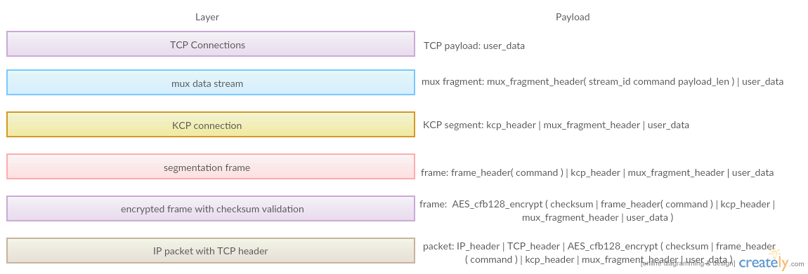

kcptun-raw
----------
为缓解部分ISP对UDP断流的问题，通过伪造TCP报文，实现了简化版的 [kcptun](https://github.com/xtaci/kcptun)。  
kcp的下层通信方式是带伪TCP报头的packet，通过raw socket实现，需要通过iptables绕过内核协议栈。

Inspired by [linhua55/some_kcptun_tools/relayRawSocket](https://github.com/linhua55/some_kcptun_tools/tree/master/relayRawSocket) .

Features
--------
* 模拟TCP三次握手、动态seq/ack（有时需要关闭），以适应各种ISP环境。  
* 两层心跳保活、快速恢复、更改随机端口重连，不容易卡死。  
* AES_CFB128加密帧。  
* 取消了FEC，丢包处理策略直接由kcp负责。  
* 请注意一个服务端进程对应一个客户端进程，如需建立多隧道或多客户端，请换个端口运行多个服务端进程。  
* 暂时仅支持linux，可配置虚拟机并让真机连接至虚拟机。  

Usage
-----
编译依赖：`libev-devel`, `openssl-devel`
```
$ make
```

```
# ./server TARGET_IP TARGET_PORT SERVER_IP SERVER_PORT [--key 16_BYTES_KEY] [--mode MODE] [--noseq]
# ./client SERVER_IP SERVER_PORT LOCAL_IP LISTEN_PORT [--key 16_BYTES_KEY] [--mode MODE] [--noseq]
```

Example:  
将`108.0.0.1`替换为服务器IP，`192.168.1.100`替换为客户端IP（通常是路由器分配的内网IP，不能使用`127.0.0.1`）  
服务端：
```
# iptables -A INPUT -p tcp --dport 888 -j DROP
# ./server 127.0.0.1 8388 108.0.0.1 888 --mode fast2
```
客户端：
```
# iptables -A INPUT -p tcp -s 108.0.0.1 --sport 888 -j DROP
# ./client 108.0.0.1 888 192.168.1.100 8388 --mode fast2
$ sslocal -s 127.0.0.1 -p 8388 -k YOUR_SS_KEY
```

如果客户端log中有大量`Re-init fake TCP connection`并且频繁断流，请尝试在客户端和服务端的命令都添加`--noseq`参数。

可选参数说明：  
* `[--mode MODE]` 加速模式，取值为`normal/fast/fast2/fast3`。默认为`fast3`。  
* `[--noseq]` 如果添加该参数，则取消伪TCP头的seq/ack自增，可避免部分ISP环境下的断流情况。  
* `[--key 16_BYTES_KEY]` AES128密钥，长度必须为16字节。默认为`it is a secrect!`。  

分层示意图
--------

